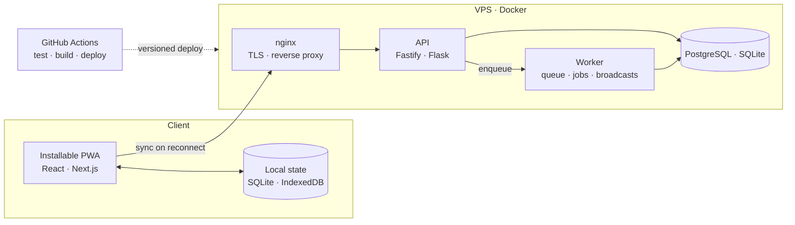

# Henrique Matere

Full-stack developer. I build internal systems and PWAs for operations still running on spreadsheets and paper — from the data model to production deployment.

Graduated in Systems Analysis and Development (IFMS, Brazil). I work on development and process automation at Gala IBB, and run my own projects under the [Hemaco IT](https://hemaco.com.br) brand. I am currently going deeper into AI- and agent-driven automation.

---

## The architecture I ship

The same shape repeats across most of my systems: an installable client that keeps working without network, a lean API, a separate worker for anything that must not block a request, and versioned deploys to my own VPS.

---

## Stack

| Layer | Tools |
|---|---|
| **Frontend** | `Next.js` `React` `TypeScript` `Vite` `Tailwind` — PWA, offline-first, mobile-first |
| **Backend** | `Fastify` `Node.js` `Flask` `Python` — REST APIs, queue workers, scheduled jobs |
| **Data** | `PostgreSQL` `SQLite` `Drizzle` `Prisma` — modeling and versioned migrations |
| **Infra** | `Docker` `nginx` `GitHub Actions` `Linux/VPS` — CI, deploy scripts, TLS |
| **Automation** | `Selenium` `WPPConnect` `pandas` — scraping, WhatsApp integration, reporting |
| **Testing & lint** | `pytest` `vitest` `ruff` `ESLint` |

---

## Projects

> My systems run for clients and for internal use, and they live in **private repositories** for confidentiality — that is why this profile has no open code. Private does not mean opaque: I walk through the architecture, the technical decisions and the code itself on request. Case studies at [hemaco.com.br](https://hemaco.com.br).

**Offline-first POS — retail store**
Checkout that keeps running when the internet drops. Local SQLite as the source of truth during the shift, a pending-operations queue, and conflict resolution on reconnect. Installable PWA, organized as a monorepo.
`React + Vite` · `Fastify` · `SQLite` · `Docker`

**Offer panel with WhatsApp broadcast — pharmacy**
Offer registration and automatic broadcast to a group. The broadcast runs in a worker separate from the web app, in its own process, so it never blocks a request nor drops a message if the service goes down. Includes a documented credential-rotation routine.
`Flask` · `Python` · `WPPConnect` · `pytest`

**Multi-user household finance tracker**
Self-hosted, multi-profile with authentication, versioned migrations, mobile-first PWA. Deployed to my own VPS with Docker + nginx and a CI pipeline.
`Next.js` · `TypeScript` · `Drizzle` · `PostgreSQL`

**Digital tab system for events**
Tabs, orders and sales during an event, with a kitchen display (KDS) designed for phones. Order/tab modeling and automated tests.
`Next.js` · `Prisma` · `vitest`

**Clinic scheduling**
Appointment and visit management, with per-practitioner calendars.
`Flask` · `Tailwind`

**Drag-and-drop floor plan editor**
Direct SVG manipulation with layout persistence, for a residential project of my own.
`Next.js` · `SVG` · `Prisma`

---

## Contact

[LinkedIn](https://www.linkedin.com/in/henriquematere/) · [contato@hemaco.com.br](mailto:contato@hemaco.com.br) · [hemaco.com.br](https://hemaco.com.br)
